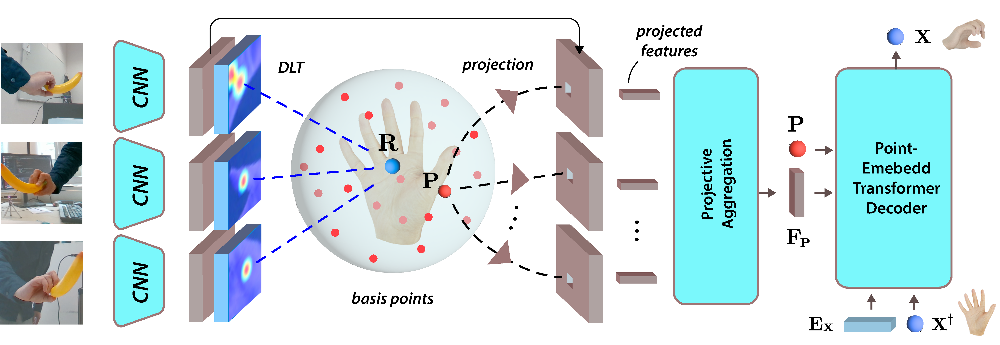

<!-- PROJECT LOGO -->

<p align="center">

  <h1 align="center">Multi-view Hand Reconstruction with a Point-Embedded Transformer</h1>
  <p align="center">
    <a><strong>Lixin Yang</strong></a>
    ·
    <a><strong>Licheng Zhong</strong></a>
    ·
    <a><strong>Pengxiang Zhu</strong></a>
    ·
    <a><strong>Xinyu Zhan</strong></a>
    ·
    <a><strong>Junxiao Kong</strong></a>
    .
    <a><strong>Jian Xu</strong></a>
    .
    <a><strong>Cewu Lu</strong></a>
  </p>
  <div align="center">
    
  </div>

  <p align="center">
    <br>
    <a href="">
      
    </a>
  </p>
</p>

POEM is a generalizable multi-view hand mesh reconstruction (HMR) model designed for practical use in real-world hand motion capture scenerios. It embeds a static basis point within the multi-view stereo space to serve as medium for fusing features across different views. To infer accurate 3D hand mesh from multi-view images, POEM introduce a point-embedded transformer decoder. By employing a combination of five large-scale multi-view datasets and sufficient data augmentation, POEM demonstrates superior generalization ability in real-world applications.
<br/><br/>

## :joystick: Instructions

- See [docs/installation.md](docs/installation.md) to setup the environment and install all the required packages.
- See [docs/datasets.md](docs/datasets.md) to download all the datasets and additional assets required.

&nbsp;

## :runner: Training and Evaluation

### Available models

We provide four models with different configurations for training and evaluation. We have evaluated the models on multiple datasets.

- set `${MODEL}` as one in `[small, medium, medium_MANO, large]`.
- set `${DATASET}` as one in `[HO3D, DexYCB, Arctic, Interhand, Oakink, Freihand]`.

Download the pretrained checkpoints at :link:[ckpt_release](https://drive.google.com/drive/folders/16BRH8zJ7fbR7QNluHHEshZMJc1wMRr_k?usp=drive_link) and move the contents to `./checkpoints`.

### Command line arguments

- `-g, --gpu_id`, visible GPUs for training, e.g. `-g 0,1,2,3`. evaluation only supports single GPU.
- `-w, --workers`, num_workers in reading data, e.g. `-w 4`.
- `-p, --dist_master_port`, port for distributed training, e.g. `-p 60011`, set different `-p` for different training processes.
- `-b, --batch_size`, e.g. `-b 32`, default is specified in config file, but will be overwritten if `-b` is provided.
- `--cfg`, config file for this experiment, e.g. `--cfg config/release/train_${MODEL}.yaml`.
- `--exp_id` specify the name of experiment, e.g. `--exp_id ${EXP_ID}`. When `--exp_id` is provided, the code requires that no uncommitted change is remained in the git repo. Otherwise, it defaults to 'default' for training and 'eval\_{cfg}' for evaluation. All results will be saved in `exp/${EXP_ID}*{timestamp}`.
- `--reload`, specify the path to the checkpoint (.pth.tar) to be loaded.

### Evaluation

Specify the `${PATH_TO_CKPT}` to `./checkpoints/${MODEL}.pth.tar`. Then, run the following command. Note that we essentially modify the config file in place to suit different configuration settings. `view_min` and `view_max` specify the range of views fed into the model. Use `--draw` option to render the results, note that it is incompatible with the computation of `auc` metric.

```shell
$ python scripts/eval_single.py --cfg config/release/eval_single.yaml
                                -g ${gpu_id}
                                --reload ${PATH_TO_CKPT}
                                --dataset ${DATASET}
                                --view_min {MIN_VIEW}
                                --view_max {MAX_VIEW}
                                --model ${MODEL}
```

The evaluation results will be saved at `exp/${EXP_ID}_{timestamp}/evaluations`.

### Training

We have used the mixature of multiple datasets packed by webdataset for training. Excecute the following command to train a specific model on the provided dataset.

```shell
$ python scripts/train_ddp_wds.py --cfg config/release/train_${MODEL}.yaml -g 0,1,2,3 -w 4
```

### Tensorboard

```shell
$ cd exp/${EXP_ID}_{timestamp}/runs/
$ tensorboard --logdir .
```

### Checkpoint

All the checkpoints during training are saved at `exp/${EXP_ID}_{timestamp}/checkpoints/`, where `../checkpoints/checkpoint` records the most recent checkpoint.

&nbsp;

## License

This code and model are available for non-commercial scientific research purposes as defined in the [LICENSE](LICENSE) file. By downloading and using the code and model you agree to the terms in the [LICENSE](LICENSE).

## Citation

```bibtex
TODO
```

For more questions, please contact Lixin Yang: siriusyang@sjtu.edu.cn
